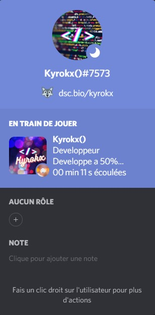

### Sreen Demo

### Configuration

**Modules requis :**

- chalk
- discord-rpc

Modifier le fichier `src/Utils/config.sample.js` en `config.js` et remplicez les différents champs.

Pour le `ClientID` entrez celui de votre application sur le site [Discord Developper Portal](https://discord.com/developers/)

## Lancer le Rich Presence

Normalement si les champs sont correctement remplies, lancez le fichier `start.bat` ou par le commande de console `npm start`

### Informations

Le projet est sous [Licence](LISENCE.md)

Mon serveur [discord](https://discord.gg/g7UMuJPmVp) en cas de probleme

### Enjoy

##🎉 Amusez-vous !